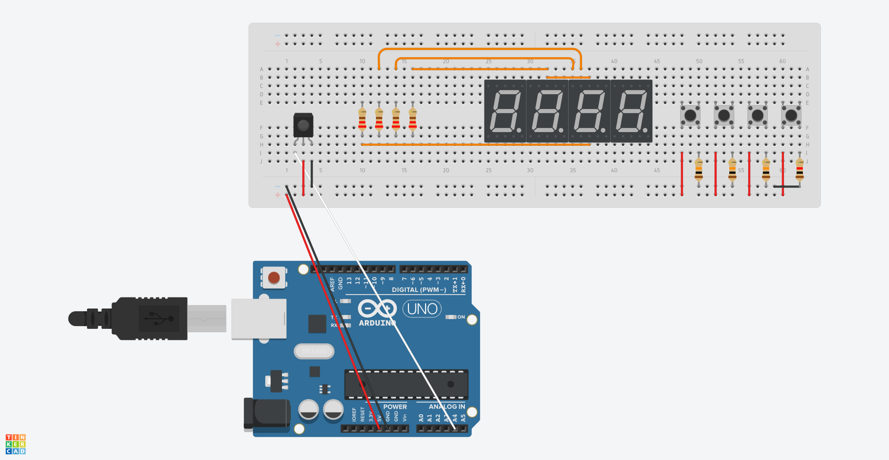
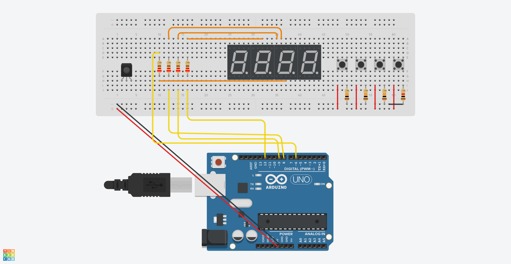
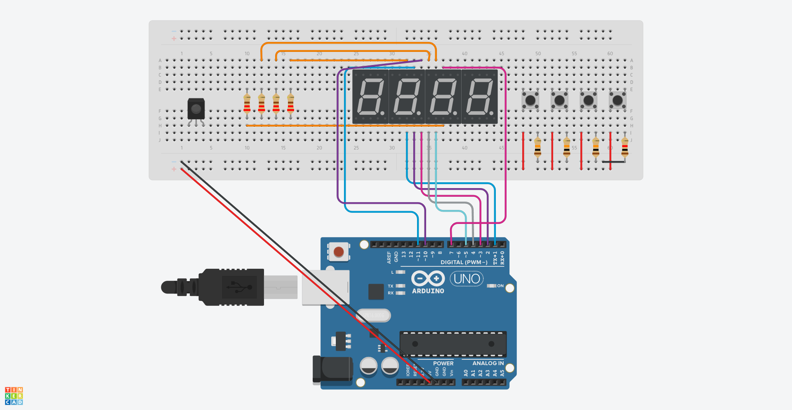
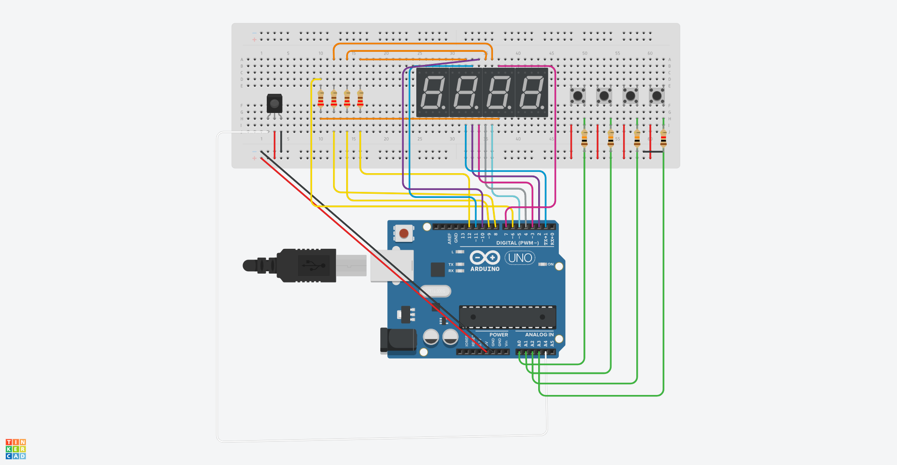

# 421

421 is a popular dice game often played in social settings. Players roll three dice and aim to achieve the lowest possible score by combining the numbers rolled. Here's how the game is typically played:

The objective of the game is to have the best combination possible at the end of each round. Each player takes turns rolling the three dice. After the roll, the player can choose to keep one or two dice and re-roll the remaining ones, or choose to keep all three dice.

[The detailed rules can be found here](https://regle.net/du-jeu-du-421/) (in french)

# How to play

Shake the sensor to roll the dice. Press the first three buttons to keep your dice roll corresponding to the button. Press the last button to hand over to the next player. The first segment displays your number of dice rolls

# Hardware List
* any Arduino (Tested with Arduino UNO R3)
* Tilt or hit sensor (I prefer hit sensor because is less sensitive) (Tested with KY-031 Hit Sensor)
* 4x 220 Ω resistor
* 4x 10 kΩ resistor
* 4x buttons
* 1x 4x7 segment display
* jumper wires

# Diagram

### **WARNING**
Electronics projects, including those involving Arduino, can involve risks, including the risk of electric shock, short circuits, and other potential hazards. It is important to exercise caution and follow proper safety procedures when working with electronic components and circuits.

The author cannot be held liable for any damages, injuries, or losses that may result from the use of the information, components, or circuits described in this tutorial. The reader is responsible for their own safety and should take appropriate measures to ensure proper safety precautions are taken when working on electronic projects.

Always double-check your connections, consult manufacturer datasheets, and follow best practices in electronics to ensure a safe and successful project.

Remember that safety is paramount when working with electronics. Proceed with caution and prioritize safety at all times.

## Only buttons

## Only sensor

## Only digit pins

## Only segment pins

## All

# Other

You can find a simple version of the code in this [branch](https://github.com/Paquito-03/421-arduino/tree/SimpleVersion)
